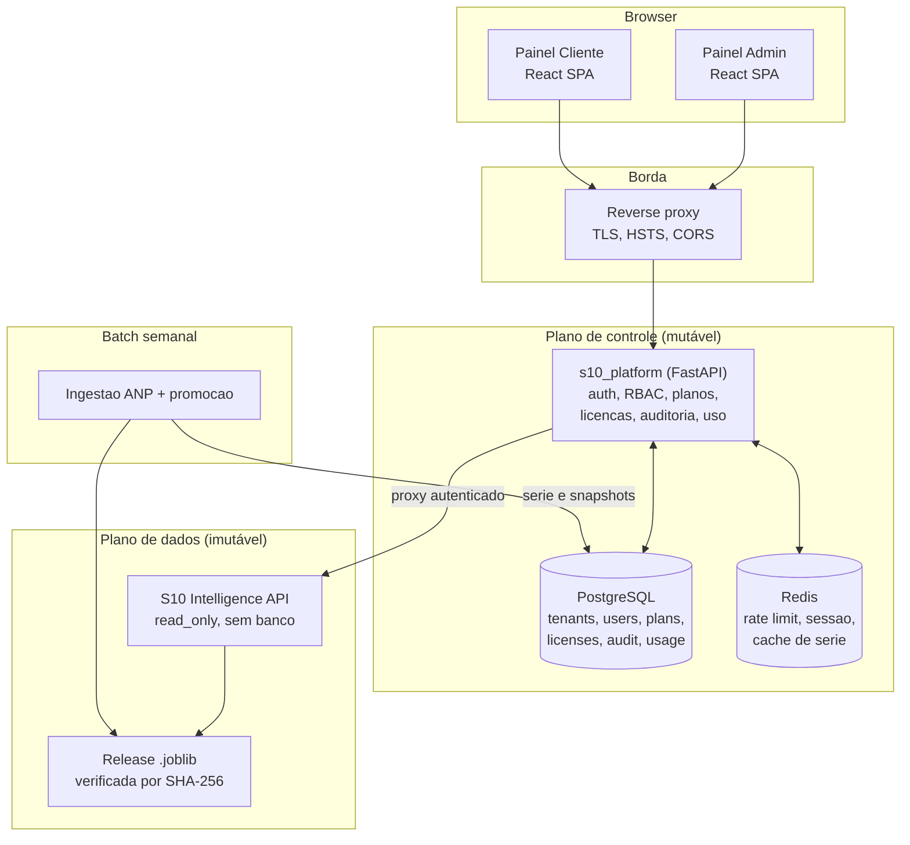
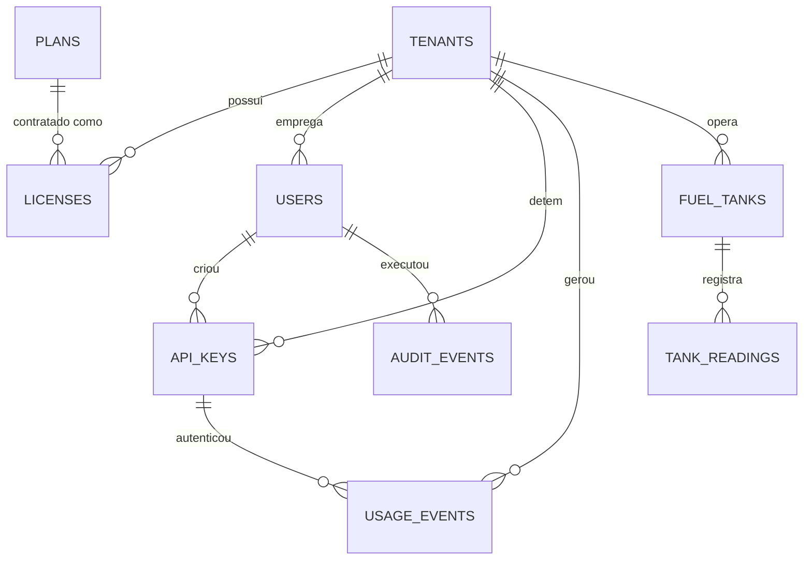
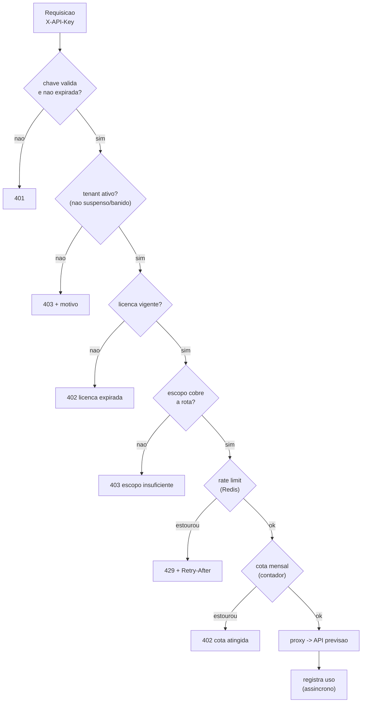

# Arquitetura da plataforma S10 — painel administrativo e painel do cliente

Documento de desenho. Descreve **para onde** a camada multi-cliente vai, partindo do que já
existe em `src/s10_tenancy/`. O núcleo de previsão está em
[architecture.md](architecture.md) e **não muda**: ele continua read-only, sem banco,
servindo uma release imutável verificada por SHA-256.

Decisões já tomadas: **Postgres** desde já (SQLAlchemy + Alembic), **SPA React/TypeScript**
para os dois painéis, e este documento aprovado antes de escrever código.

---

## 1. O que existe hoje e o que falta

O gateway atual (`gateway.py`, 340 linhas) já resolve quatro coisas bem, e vale preservar o
desenho delas:

| Já funciona | Por que preservar |
|---|---|
| Chave de API guardada como `sha256`, exibida uma vez | Vazamento do banco não entrega as chaves. Mantido. |
| Cota mensal indexada por `period` (`YYYY-MM`) | `COUNT` indexado em vez de scan com `strftime`. Mantido. |
| Rate limit **por cliente**, não por IP | Transportadoras atrás do mesmo NAT não competem. Mantido. |
| Desativação em vez de exclusão | Consumo registrado sobrevive para cobrança e auditoria. Mantido. |
| Separação gateway ⟷ API de previsão | Gateway cai, previsão continua servida. **Este é o princípio central e ele se mantém.** |

O que falta — e é por isso que está "cru":

1. **Não existe usuário.** Existe *tenant* e existe *chave de API*. Um humano não consegue
   fazer login em painel nenhum. Sem isso não há painel, só `curl`.
2. **Admin é um token compartilhado.** `X-Admin-Token` é um segredo único: não há "quem
   baniu o cliente 7", não há revogação individual, não há segundo administrador.
3. **Plano é uma string livre.** `plan TEXT DEFAULT 'piloto'` com `monthly_quota` e
   `rate_limit` soltos na linha do tenant. Mudar o preço do plano Pro exige `UPDATE` em
   todos os clientes; não há histórico de qual plano o cliente tinha em março.
4. **Não há licença com validade.** Nada expira. Um piloto de 90 dias vira permanente por
   omissão.
5. **Banir e revogar não são a mesma coisa, mas o código trata como se fossem.**
   `deactivate_tenant` derruba tudo. Falta suspender (inadimplência, reversível) versus
   banir (definitivo, com motivo registrado).
6. **Não há trilha de auditoria administrativa.** `usage_events` registra o que o *cliente*
   fez; nada registra o que o *admin* fez.
7. **O painel do cliente não tem o que mostrar.** O gateway só repassa `/v1/forecast` — a
   previsão de uma semana. Um painel de acompanhamento precisa de **série histórica**, e ela
   não é exposta por nenhuma rota.
8. **SQLite com um lock global de processo.** `threading.Lock` serializando toda escrita:
   correto para um piloto, teto baixo para produção e impossível de rodar em duas réplicas.

---

## 2. Visão de topo



**A regra que organiza tudo:** o plano de dados nunca escreve, o plano de controle nunca
prevê. Se o Postgres cair, a API de previsão continua respondendo a quem já tem chave em
cache — degradação parcial, não queda total. Essa separação já existe no código atual e é o
que há de mais valioso nele.

### Por que um serviço só no plano de controle (e não microsserviços)

Admin, cliente e proxy compartilham o mesmo modelo de dados (tenant, usuário, plano, uso).
Separá-los em serviços distintos agora criaria transações distribuídas para operações que
são um `UPDATE` — o custo é imediato e o benefício é hipotético. **Modularizar por domínio
dentro de um processo, com fronteiras explícitas**, permite extrair depois se a carga pedir.
O que já está separado — previsão e controle — está separado pela razão certa: ciclos de vida
e requisitos de integridade diferentes.

---

## 3. Modelo de dados

Substitui as três tabelas atuais. Postgres, migrado por Alembic desde a primeira versão.



### 3.1 Identidade e organização

**`tenants`** — a empresa cliente. Ganha estado explícito no lugar do booleano `active`:

```
status ∈ {trial, active, suspended, banned}
```

`suspended` é reversível (inadimplência, uso abusivo em análise); `banned` é terminal e
exige registro de motivo. Hoje `active=0` colapsa os dois e perde a informação de *por quê*.
Ganha ainda `slug` (subdomínio/URL do painel) e `deleted_at` para exclusão lógica.

**`users`** — **a tabela que não existe hoje e sem a qual não há painel.** Um humano com
login. Campos: `tenant_id` (NULL para administradores da plataforma), `email` único,
`password_hash` (**Argon2id**, não bcrypt — resistência a GPU), `role`, `status`,
`last_login_at`, `failed_login_count`, `locked_until`, `mfa_secret`, `mfa_enabled`.

O `tenant_id` NULL é o que separa nós dos clientes: administrador da plataforma não pertence
a tenant nenhum. Isso torna impossível, por construção, um usuário de cliente enxergar dados
de outro — a consulta sempre filtra por `tenant_id`, e um usuário de plataforma passa por
outro caminho de autorização.

### 3.2 Comercial

**`plans`** — o catálogo, versionado. Hoje o plano é texto solto no tenant; aqui vira linha
própria com `code`, `name`, `monthly_quota`, `rate_limit_per_minute`, `max_users`,
`max_api_keys`, `features` (JSONB: `{"estoque": true, "horizonte_12s": false}`),
`price_cents`, `currency`, `is_public`, `version`.

**Um plano nunca é editado — é versionado.** Mudar o preço do Pro cria `pro` v2; contratos em
v1 continuam em v1 até renovarem. Sem isso, um `UPDATE` na tabela de planos reescreve
retroativamente o que cada cliente contratou, e a fatura passada deixa de ser reconstituível.

**`licenses`** — o contrato entre tenant e plano, e o coração da gestão que você descreveu.
Campos: `tenant_id`, `plan_id`, `status ∈ {pending, active, expired, cancelled}`,
`starts_at`, `expires_at`, `auto_renew`, `quota_override`, `rate_limit_override`,
`seats`, `cancelled_reason`.

Por que separar de `tenants`: um cliente tem **histórico** de licenças (piloto → Pro →
Enterprise). Com plano dentro do tenant, cada upgrade apaga o passado. Aqui, a licença
vigente é `status='active' AND now() BETWEEN starts_at AND expires_at`, e as anteriores
ficam. Os campos `*_override` permitem negociar cota fora do plano sem criar um plano
fantasma por cliente.

**Constraint:** índice único parcial garantindo **no máximo uma licença ativa por tenant** —
a regra fica no banco, não só no código, porque duas licenças ativas dariam ao cliente a
soma das cotas em silêncio.

### 3.3 Acesso programático

**`api_keys`** — mantém o desenho atual (`key_hash`, `key_prefix`, exibição única) e ganha:
`created_by_user_id` (quem emitiu), `scopes` (array — `forecast:read`, `history:read`,
`inventory:write`), `expires_at`, `last_used_at`, `revoked_by_user_id`, `revoked_reason`.

`scopes` é o que torna a integração com ERP segura: a chave que o ERP do cliente usa para
puxar previsão não precisa poder escrever estoque. `last_used_at` responde "esta chave ainda
é usada?" antes de uma rotação.

**Rotação sem downtime:** o cliente emite a chave nova, atualiza o ERP, revoga a antiga.
Como já há N chaves por tenant, isso funciona sem mudança de modelo — falta só a UI expor.

### 3.4 Observação e auditoria

**`usage_events`** — o desenho atual (com `period` indexado) preservado, mais `request_id`
(correlaciona com o log da API de previsão) e `response_bytes`.
**Particionamento por mês** no Postgres: descartar dados velhos vira `DROP PARTITION` em vez
de um `DELETE` que trava a tabela.

**`usage_counters`** — agregado `(tenant_id, period)` com `calls`, `errors`, `sum_latency_ms`,
incrementado por `UPSERT` a cada chamada. Hoje `usage_this_period` faz `COUNT(*)` **a cada
requisição autenticada**: no início do mês é barato, no fim do mês com 10.000 eventos é um
scan por chamada. O contador transforma a checagem de cota em leitura de uma linha.

**`audit_events`** — **a tabela que hoje não existe.** Toda ação administrativa:
`actor_user_id`, `actor_ip`, `action` (`tenant.banned`, `key.revoked`, `license.upgraded`),
`target_type`, `target_id`, `before` / `after` (JSONB), `reason`, `created_at`.

Sem ela, "quem baniu este cliente e por quê" não tem resposta. Ela é **append-only**: sem
`UPDATE`, sem `DELETE`, garantido por permissão de banco (o usuário da aplicação recebe
apenas `INSERT` e `SELECT`). Vale considerar encadeamento por hash no mesmo espírito do
`audit.py` do núcleo — a plataforma já sabe fazer isso, e é coerente com um produto que
vende evidência auditável.

### 3.5 Série histórica (painel do cliente)

**`price_observations`** — read-model populado pelo batch semanal: `week_ending`, `scope`
(`BR` ou UF), `price_brl_per_liter`, `source_sha256`, `ingested_at`.

**`forecast_snapshots`** — cada previsão publicada: `issued_at`, `target_week`, `scope`,
`point`, `lower`, `upper`, `interval_level`, `release_sha256`, `model_id`.

`forecast_snapshots` é o que permite ao painel mostrar **"o que prevemos versus o que
aconteceu"** — a tela que constrói confiança no produto, e que hoje é impossível porque a API
só devolve a previsão corrente. Guardar `release_sha256` amarra cada ponto do gráfico à
release que o gerou.

### 3.6 Estoque (fase 4, se der tempo)

**`fuel_tanks`** (`tenant_id`, `label`, `capacity_liters`, `min_level_liters`, `fuel_type`,
`site_name`) e **`tank_readings`** (`tank_id`, `measured_at`, `level_liters`, `source`,
`recorded_by_user_id`).

**Nível é evento, não campo.** Um `current_level` no tanque é sobrescrito e perde o histórico
— e sem histórico não há consumo médio, e sem consumo médio não há previsão de ruptura, que é
o único motivo de o módulo existir. `tank_readings` append-only dá as duas coisas de graça.

O cruzamento com o núcleo: consumo médio diário + nível atual = dias de autonomia; a previsão
de preço diz se conviria antecipar a compra. **É aqui que os dois painéis se encontram** — e
é o argumento de produto mais forte do TCC.

---

## 4. Isolamento entre clientes

Três camadas, porque uma falha sozinha:

1. **Aplicação** — toda query passa por um repositório que recebe `tenant_id` do contexto da
   requisição; não existe caminho que aceite `tenant_id` vindo do corpo ou da query string
   para um usuário de cliente.
2. **Banco (RLS)** — `ROW LEVEL SECURITY` nas tabelas com `tenant_id`, com policy sobre
   `current_setting('app.tenant_id')`, definido por transação. **Um `WHERE` esquecido devolve
   zero linhas em vez de vazar dados do vizinho.** É a rede de segurança que justifica
   Postgres em vez de SQLite.
3. **Teste** — um teste de contrato que, para cada rota do painel do cliente, tenta acessar
   recurso de outro tenant e exige 404 (não 403: 403 confirma que o recurso existe).

**404, não 403.** Responder 403 a `/v1/tanks/91` informa que o tanque 91 existe em outra
empresa. Enumerar IDs vira reconhecimento da base de clientes.

---

## 5. Autenticação e autorização

### 5.1 Três identidades distintas

| Quem | Como se autentica | Onde |
|---|---|---|
| Admin da plataforma | e-mail + senha (Argon2id) + **MFA obrigatório** | Painel admin |
| Usuário do cliente | e-mail + senha, MFA opcional | Painel cliente |
| ERP / máquina | `X-API-Key` (mantém o desenho atual) | Integração |

MFA obrigatório para admin não é excesso: essa conta bane clientes e emite chaves. É a conta
que compromete todas as outras.

### 5.2 Sessão de painel

**Access token JWT curto (15 min) + refresh token opaco (7 dias) em cookie `HttpOnly`,
`Secure`, `SameSite=Strict`.**

O refresh é opaco e guardado em `sessions` (hash) justamente para ser **revogável** — banir um
cliente precisa derrubar as sessões abertas dele *agora*, e JWT puro não permite isso sem uma
denylist que acaba sendo o mesmo banco. Rotação a cada refresh, com detecção de reuso: um
refresh já usado invalida a família inteira de tokens (sinal de roubo).

**Nunca em `localStorage`** — qualquer XSS lê `localStorage`; cookie `HttpOnly` não é
alcançável por JS. Com `SameSite=Strict` mais um header `X-CSRF-Token` nas rotas mutáveis, o
CSRF fica coberto.

### 5.3 RBAC

```
platform_admin     tudo, inclusive banir e emitir licenca
platform_support   le tudo, muda nada (suporte que nao vira vetor de ataque)
tenant_owner       gere usuarios, chaves e assinatura do proprio tenant
tenant_operator    opera estoque e ve previsao
tenant_viewer      so leitura
```

Papel é **enum, não string livre**: uma string aceita `"admn"` e falha aberto se o código
comparar por igualdade. Autorização como dependência FastAPI declarativa
(`Depends(require_role(Role.TENANT_OWNER))`), auditável lendo a assinatura da rota —
segurança que não se enxerga na leitura do código não é revisável.

### 5.4 Defesas de login

Lockout progressivo (`failed_login_count` + `locked_until`), rate limit por IP **e** por
e-mail, resposta genérica ("credenciais inválidas") para não enumerar contas, e tempo de
resposta constante mesmo quando o e-mail não existe — Argon2id contra um hash fixo.

---

## 6. Aplicação da licença no caminho da requisição

O que hoje é um `if` no `require_tenant` vira uma cadeia explícita, na ordem do mais barato ao
mais caro:



Três correções em relação a hoje:

**Rate limit no Redis, não em memória.** O `_TenantRateLimiter` atual guarda um `deque` por
tenant no processo: com duas réplicas, o cliente recebe o dobro do limite contratado, e um
restart zera todos os contadores. Sliding window no Redis (`INCR` + `EXPIRE`, ou script Lua
para atomicidade) resolve os dois. **É o que destrava rodar mais de uma réplica** — sem isso a
plataforma não escala horizontalmente sem quebrar o contrato comercial.

**Registro de uso assíncrono.** Hoje `record_usage` faz `INSERT` + `commit` **na thread da
requisição, segurando o lock global**. Vira enfileiramento em memória com flush em lote (a
cada 1s ou 100 eventos) por uma task de background. O contador agregado, esse sim, é
atualizado de forma síncrona, porque cota precisa ser exata — a diferença é que atualizar um
contador é uma linha, e inserir o evento detalhado pode esperar.

**Cota lida do contador**, não de um `COUNT(*)` por requisição (§3.4).

### Degradação quando o Postgres cai

Cache local de resolução de chave (TTL curto, ~60s) permite continuar servindo previsão a
quem já chamou recentemente, contabilizando uso em memória para flush posterior. Chave nova
falha; cliente ativo continua atendido. **Em dúvida sobre cota, servir e registrar** — negar
previsão a um cliente pagante por indisponibilidade de banco é o pior desfecho dos dois.

---

## 7. Os dois painéis

### 7.1 Painel administrativo (nós)

| Tela | Conteúdo |
|---|---|
| **Visão geral** | Clientes ativos, receita por plano, chamadas na semana, top consumidores, clientes perto do teto de cota (oportunidade de upgrade), erros por cliente |
| **Clientes** | Lista com busca/filtro por status e plano; ficha com licença vigente, histórico de planos, usuários, chaves, consumo e linha do tempo de auditoria |
| **Ciclo de vida** | Suspender (motivo obrigatório), reativar, banir (confirmação por digitação do nome + motivo), encerrar licença |
| **Planos e licenças** | Catálogo versionado, criar nova versão, atribuir licença, override de cota, renovação e vencimentos próximos |
| **Chaves** | Emitir em nome do cliente (exibição única), revogar com motivo, ver `last_used_at` |
| **Auditoria** | `audit_events` filtrável por ator, ação e período; exportável |
| **Saúde** | Readiness da API de previsão, release servida e seu hash, atualidade da previsão, alertas dos gates |

Ações destrutivas com **confirmação por digitação e motivo obrigatório** — o motivo vai para
`audit_events` e é o que torna a decisão defensável depois.

### 7.2 Painel do cliente

| Tela | Conteúdo |
|---|---|
| **Início** | Preço da semana, variação, previsão da próxima com intervalo, recomendação (antecipar/aguardar) e o **porquê** |
| **Série e previsão** | Gráfico histórico + faixa de previsão + **previsões passadas contra o realizado** (a tela que constrói confiança) |
| **Cenário de custo** | Volume do cliente → exposição em R$ nos cenários P10/P50/P90 |
| **Integração** | Chaves próprias, escopos, exemplos de `curl`, link do OpenAPI, webhooks |
| **Consumo** | Chamadas no mês contra a cota, por rota, latência — o mesmo número que aparece na fatura |
| **Estoque** (fase 4) | Tanques, nível, autonomia em dias, alerta de ruptura cruzado com a previsão de preço |
| **Conta** | Usuários do tenant, papéis, MFA, plano vigente |

**O cliente vê exatamente os mesmos números de consumo que o admin.** Divergência entre o
painel e a fatura destrói confiança mais rápido do que qualquer indisponibilidade.

### 7.3 Frontend

Vite + React + TypeScript, dois apps num monorepo com pacotes compartilhados
(`packages/api-client` gerado do OpenAPI, `packages/ui`). Roteamento com `react-router`,
estado de servidor com TanStack Query, gráficos com Recharts ou visx.

**Cliente HTTP gerado do OpenAPI** (o FastAPI já publica `/openapi.json`): rota que muda de
contrato quebra o **build** do frontend, não a tela do cliente em produção. É a checagem mais
barata que existe entre dois times ou duas pastas.

Dois apps e não um: reduzem a superfície de erro em que um bug de renderização mostra dado de
admin a cliente, e permitem publicar o admin em host separado, atrás de VPN se preciso.

**CSP restritiva** (`default-src 'self'`, sem `unsafe-inline`), sem token em `localStorage`,
e nenhuma decisão de autorização confiada ao frontend — esconder um botão é UX, não segurança;
a regra vale no servidor.

---

## 8. Estrutura de código

```
src/
  vs_epl_krls/          # nucleo de previsao -- INTOCADO
  s10_platform/         # ex-s10_tenancy, promovido
    domain/             # entidades e regras, sem SQLAlchemy nem FastAPI
      tenant.py  user.py  plan.py  license.py  api_key.py  usage.py
    infrastructure/
      database.py  models.py  repositories/  redis_client.py
      migrations/       # Alembic
    application/        # casos de uso, transacao e auditoria
      auth_service.py  tenant_service.py  license_service.py
      usage_service.py  audit_service.py  forecast_proxy.py
    api/
      dependencies.py   # auth, RBAC, contexto de tenant
      middleware.py     # request-id, headers, CSRF
      routes/
        auth.py  admin_tenants.py  admin_plans.py  admin_licenses.py
        admin_audit.py  client_account.py  client_keys.py
        client_forecast.py  client_usage.py  client_inventory.py
      schemas/
    workers/
      usage_flusher.py  license_expirer.py  history_sync.py
web/
  apps/admin/  apps/client/  packages/api-client/  packages/ui/
```

**`domain/` sem import de framework** é o que permite testar regra de licença sem subir banco
nem HTTP — e a regra de licença é onde os bugs custam dinheiro. O núcleo do repositório já
segue essa disciplina (`gates.py` recebe limiares como argumento, não como constante
escondida); a plataforma herda o mesmo padrão.

Renomear `s10_tenancy` → `s10_platform`: o escopo passou de tenancy para produto inteiro. Faça
agora, enquanto custa um `git mv` e uma linha no `pyproject.toml`.

---

## 9. Migração do que já existe

Nada é jogado fora. Cinco passos, cada um com o sistema funcionando ao fim:

1. **Alembic sobre o schema atual.** Migração inicial reproduzindo `tenants`, `api_keys`,
   `usage_events` como estão, agora em Postgres. Repositórios substituem o SQL direto; os
   testes de `test_tenancy.py` continuam passando — eles são a rede de segurança do passo.
2. **Usuários e RBAC.** Novas tabelas, login, sessão. `X-Admin-Token` continua funcionando em
   paralelo, marcado como deprecated, para não quebrar o que existe.
3. **Planos e licenças.** Migração de dados: cada `tenants.plan` distinto vira uma linha em
   `plans`; cada tenant ganha uma `license` ativa com a cota que já tinha. Ninguém perde
   acesso. `tenants.plan/monthly_quota/rate_limit` viram colunas legadas e depois somem.
4. **Uso e auditoria.** Contadores agregados (backfill a partir de `usage_events`), flush
   assíncrono, `audit_events`, rate limit no Redis. Aqui `X-Admin-Token` é removido.
5. **Série histórica e painéis.** `price_observations` / `forecast_snapshots` populados pelo
   batch semanal (`weekly_refresh.py` já existe e é o lugar certo), rotas de leitura, SPAs.

Estoque (§3.6) entra depois disso, e só se houver tempo — é o único item verdadeiramente
opcional.

---

## 10. Operação

**Ambientes:** compose local com Postgres + Redis + os dois serviços; produção com API de
previsão e plano de controle em containers separados, atrás de um proxy que termina TLS.
A API de previsão **mantém `read_only: true` e `cap_drop: ALL`** — a decisão mais forte do
`compose.yaml` atual e ela não muda.

**Segredos** por variável de ambiente/secret manager, nunca no repositório. `SECRET_KEY` do
JWT com rotação por `kid` no header (permite rotacionar sem invalidar tudo).

**Backup:** `pg_dump` diário + WAL archiving. **Restauração testada** — backup não verificado é
suposição, e o dado que sustenta faturamento não é lugar de suposição. Retenção de
`usage_events` por 13 meses (fecha o ano fiscal), `audit_events` por 5 anos.

**LGPD:** o dado pessoal é pouco e isso é bom — nome, e-mail corporativo, CNPJ. Exclusão de
tenant é lógica, preservando `audit_events` e `usage_events` agregados (base legal de
obrigação fiscal), com anonimização dos campos pessoais em `users`. Documentar a base legal de
cada retenção antes de precisar dela.

**Observabilidade:** o `request_id` já propagado pela API de previsão passa a atravessar o
gateway, ligando a linha do log do cliente à do serviço. Métricas Prometheus por tenant
(chamadas, erros, latência, cota) — o `/metrics` do núcleo já tem o formato certo.

---

## 11. Riscos

| Risco | Mitigação |
|---|---|
| Escopo grande demais para o prazo do TCC | Fases 1–3 já entregam produto defensável; estoque é explicitamente opcional |
| Vazamento entre tenants | RLS + repositório com contexto + teste de contrato (§4) |
| Divergência painel × fatura | Uma fonte de verdade: os mesmos contadores nas duas telas |
| Rate limit inconsistente com réplicas | Redis desde a fase 4, antes de existir a segunda réplica |
| Painel de previsão sem série histórica | `forecast_snapshots` populado desde a fase 1, mesmo antes do painel — dado não coletado é dado perdido |
| Conta admin comprometida | MFA obrigatório, auditoria append-only, `platform_support` sem escrita |

---

## 12. O que decidir antes de codar

1. **Faturamento** é dentro do produto ou fora (planilha/ERP nosso)? Muda se `licenses`
   precisa de ciclo de cobrança e integração com gateway de pagamento. Recomendação para o
   TCC: **fora** — a licença registra o contrato, a cobrança é manual.
2. **Webhooks** (avisar o ERP quando sai previsão nova) na fase 5 ou depois? Alto valor de
   integração, custo real (retry, assinatura HMAC, dead letter).
3. **Multi-região por tenant**: cada cliente escolhe suas UFs de interesse? Afeta
   `licenses.features` e o read-model da série.
4. **Auto-cadastro** ou só cadastro por nós? Auto-cadastro exige verificação de e-mail,
   trial automático e antifraude. Recomendação: **só por nós** nesta etapa.
